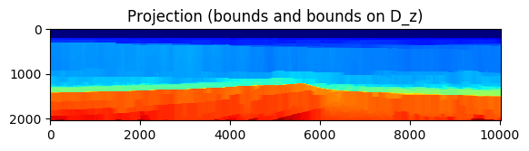

# SetIntersectionProjection


SetIntersectionProjection is a Julia 0.6 package mainly developed by Bas Peters that computes projections of vectorized 2D and 3D images/models,
<!-- #$$\mathcal{P}_{\mathcal{V}} (\mathbf{m}) \in \arg\min_{\mathbf{x}} \frac{1}{2} \| \mathbf{x} - \mathbf{m} \|_2^2 \quad \text{subject to} \quad \mathbf{m} \in\bigcap_{i=1}^p \mathcal{V}_i,$$ -->

 , onto intersections of p convex and non-convex sets:


Performance for non-convex sets is empirical. Our main algorithm, Projection Adaptive Relaxed Simultaneous Direction Method of Multipliers (PARSDMM), solves the projection problem as
<!-- $$
\min_{\mathbf{x}} \frac{1}{2} \| \mathbf{x} - \mathbf{m} \|_2^2 + \sum_{i=1}^{p-1} \iota_{\mathcal{C}_i}(A_i \mathbf{x}).
$$-->


Each set `V_i` is characterized as an 'elementary' set `C_i`, for which we know a closed form projection (l1-ball, l2-ball, bounds, nuclear norm, rank, cardinality, annulus, ...) and a transform-domain operator `A_i` (discrete derivatives, DFT, DCT, Curvelet transform, anisotropic total-variation,...). For example, if we have `V = { x | ||Ax||_1 <= sigma } `, then we use a transform-domain operator `A` and set `C = { y | ||y||_1 <= sigma }` with additional equality constraints `Ax=y`.

The input for the algorithm are thus pairs of projector onto `C_i` and transform-domain operator `A_i`. The software can also solve the feasibility problem by dropping the squared distance from `m` term. The main applications are inverse problems. For inverse problems with 'expensive' forward operators, we can use SetIntersectionProjection as the projector onto an intersection of constraints to solve <!--$\min_{\mathbf{m}} f(\mathbf{m})  \:\: \text{subject to} \:\: \mathbf{m} \in \bigcap_{i=1}^p \mathcal{V}_i$--> with a spectral projected gradient / projected quasi-Newton / projected-Newton method. If we need to solve a linear inverse problem with a 'cheap' forward operator `B` we include a data-fit constraint, such as `{ x | l <= (Bx - d_{observed})_i <= u_i }` or `{ x | || Bx - d_{observed} ||_2 = c }` and solve
<!-- 
$$
\min_{\bx,\by_i} \frac{1}{2}\| \bx - \bm \|_2^2 + \sum_{i=1}^{p-1} \iota_{\mathcal{C}_i}(\by_i) + \iota_{\mathcal{C}_p^\text{data}}(\by_p)\quad \text{s.t.} \quad \begin{cases}
A_i \bx = \by_i \\ B\bx=\by_p
\end{cases},
$$
-->


Main features:

- parametric typing for Float32 and Float64 support
- includes scripts to set up projectors and transform-domain operators For 2D and 3D models
- works in parallel with $1$ Julia worker per constraint
- some constraints also use Julia Threads to compute sub-problems in parallel on each worker
- serial part of code also uses multithreading and mulithreaded BLAS operations
- transform-domain operators may be: SparseMatrixCSC, JOLI (https://github.com/slimgroup/JOLI.jl) DCT/DFT/Curvelet matrix-free operators
- constraints may be defined for the matrix/tensor model and for columns/slices/fibres simultaneously
- stores `AtA[i]=A_i^T A` in compressed diagonal storage (CDS or DIA format) if all 'A_i' have a banded structure. This saves memory compared to standard Julia `SparseMatrixCSC` format. We also use a multithreaded matrix-vector product which is faster than the Julia `SparseMatrixCSC` matrix-vector product

List of constraints, transform-domain operators and short function description

Applications:

 - [Seismic full-waveform inversion with set intersection constraints](docs/README_freq_FWI_ex.md)
 - [Joint image denoising-deblurring-inpainting or image desaturation by learning a parametric intersection of (non-)convex sets](docs/README_image_proc_constraint_learning.md)

Tutorials:

 - [Project a 2D image onto an intersection of sets with parallel and multilevel PARSDMM](examples/projection_intersection_2D.jl)
 - [Project a 3D image onto an intersection of sets with parallel and multilevel PARSDMM](examples/projection_intersection_3D.jl)
  
Performance:

 - [timings for projections of 2D and 3D models vs grid size, computational cost parallel Dykstra vs PARSDMM](examples/README_PARSDMM_performance.md)
 - [timings Julia 0.6 SparseMatrixCSC mat-vec vs our multi-threaded compressed-diagonal mat-vec]
 
The following example illustrates the basic usage. We will project an image onto a set that is the intersection of bound constraint, vertical monotonicity (slope-constraints) and horizontal smoothness (another type of slope-constraint). This is a serial (single-level) example. Use parallel and or multi-level version for larger problems. 

```julia
@everywhere using SetIntersectionProjection
using MAT
using PyPlot

type compgrid
  d :: Tuple
  n :: Tuple
end

#PARSDMM options:
options=PARSDMM_options()
options.FL=Float32

set_zero_subnormals(true)
BLAS.set_num_threads(2)
FFTW.set_num_threads(2)

#select working precision
if options.FL==Float64
  TF = Float64
  TI = Int64
elseif options.FL==Float32
  TF = Float32
  TI = Int32
end

#load image to project
file = matopen("compass_velocity.mat")
m=read(file, "Data")
close(file)
m=m[1:341,200:600];
m=m';

#set up computational grid (25 and 6 m are the original distances between grid points)
comp_grid = compgrid((TF(25), TF(6)),(size(m,1), size(m,2)))
m=convert(Vector{TF},vec(m))
```

Now we are ready to decide what constraints we want to use. We select bounds constraints (bounds may be scalar or vector valued) as well as bound constraints on the vertical (z-direction) discrete derivative of the image. This also known as a slope constraint and we use it to achieve monotonicity of the pixel values from top to bottom.

We provide scripts to generate projectors and transform-domain operators, but you can build your own as well.

```julia
#constraints
constraint=Dict() #initialize dictionary

constraint["use_bounds"]=true
constraint["m_min"]=1500
constraint["m_max"]=4500

constraint["use_TD_bounds_1"]=true;
constraint["TDB_operator_1"]="D_z";
constraint["TD_LB_1"]=0;
constraint["TD_UB_1"]=1e6;

options.parallel             = false
(P_sub,TD_OP,TD_Prop) = setup_constraints(constraint,comp_grid,options.FL)
```

Once we have projectors and transform-domain operators, we use `PARSDMM_precompute_distribute` to precompute and distribute things, followed by actually projecting `m` and plotting the results.

```julia
(TD_OP,AtA,l,y) = PARSDMM_precompute_distribute(TD_OP,TD_Prop,comp_grid,options)

println("")
println("PARSDMM serial (bounds and bounds on D_z):")
@time (x,log_PARSDMM) = PARSDMM(m,AtA,TD_OP,TD_Prop,P_sub,comp_grid,options);
@time (x,log_PARSDMM) = PARSDMM(m,AtA,TD_OP,TD_Prop,P_sub,comp_grid,options);
@time (x,log_PARSDMM) = PARSDMM(m,AtA,TD_OP,TD_Prop,P_sub,comp_grid,options);

#plot

#define axis limits and colorbar limits for plotting
xmax = comp_grid.d[1]*comp_grid.n[1]
zmax = comp_grid.d[2]*comp_grid.n[2]
vmi=1500
vma=4500

figure();imshow(reshape(m,(comp_grid.n[1],comp_grid.n[2]))',cmap="jet",vmin=vmi,vmax=vma,extent=[0,  xmax, zmax, 0]); title("model to project")
figure();imshow(reshape(x,(comp_grid.n[1],comp_grid.n[2]))',cmap="jet",vmin=vmi,vmax=vma,extent=[0,  xmax, zmax, 0]); title("Projection (bounds and bounds on D_z)")

#plot PARSDMM logs
figure();
subplot(3, 3, 3);semilogy(log_PARSDMM.r_pri)          ;title("r primal")
subplot(3, 3, 4);semilogy(log_PARSDMM.r_dual)         ;title("r dual")
subplot(3, 3, 1);semilogy(log_PARSDMM.obj)            ;title(L"$ \frac{1}{2} || \mathbf{m}-\mathbf{x} ||_2^2 $")
subplot(3, 3, 2);semilogy(log_PARSDMM.set_feasibility);title("TD feasibility violation")
subplot(3, 3, 5);plot(log_PARSDMM.cg_it)              ;title("nr. of CG iterations")
subplot(3, 3, 6);semilogy(log_PARSDMM.cg_relres)      ;title("CG rel. res.")
subplot(3, 3, 7);semilogy(log_PARSDMM.rho)            ;title("rho")
subplot(3, 3, 8);plot(log_PARSDMM.gamma)              ;title("gamma")
subplot(3, 3, 9);semilogy(log_PARSDMM.evol_x)         ;title("x evolution")
tight_layout()

```





