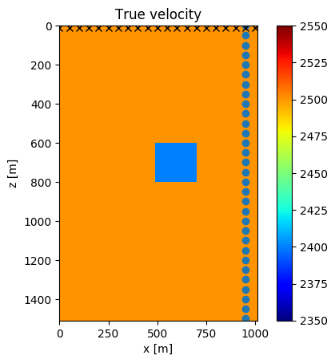
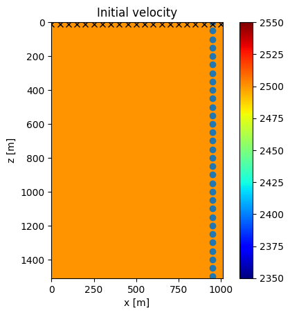
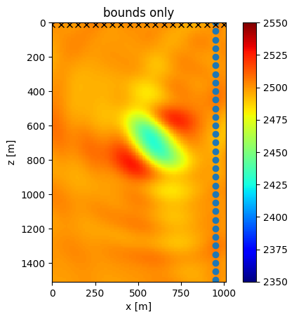
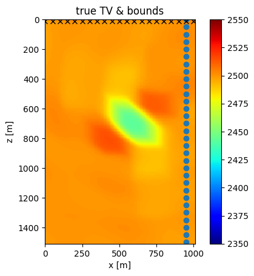
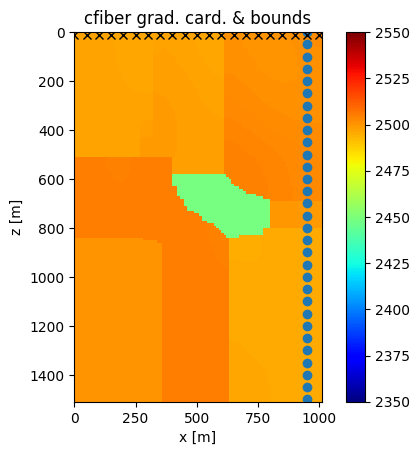
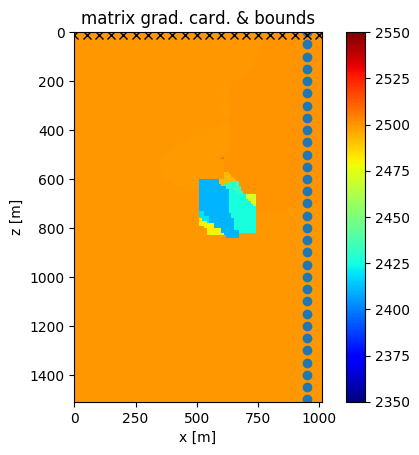
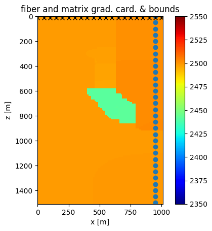
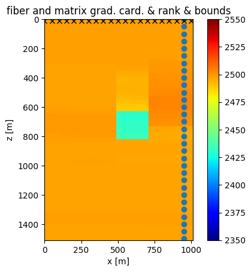

#Image processing by learning a parametric intersection of (non-)convex sets

[Julia script for this example a) (joint image denoising+deblurring+inpainting)](../examples/examples/Ecuador_deblurring_inpainting/deblurring_inpainting_by_constraint_learning_SA.jl)

[Julia script for this example b) (image desaturation)](../examples/examples/Indonesia_deblurring/image_desaturation_by_constraint_learning.jl)

The applications of interest for this example are linear inverse problems, such as removing motion blur with a known blurring kernel and inpainting of missing pixels, single-image super-resolution, denoising, and desaturation of saturated images. We use aerial photos as the target. 

Several recent works on linear imaging inverse problems [e.g., @7949028, @Chang_2017_ICCV] use neural networks that require large datasets containing hundreds to hundreds of thousands of training examples. On the other hand, there are methods that do not require training, such as basis-pursuit type formulations [e.g., @MRM:MRM21391, @Candes2009, @doi:10.1137/080714488, @Becker2011, @doi:10.1137/130919210] often minimize the ``\ell_1``-norm of transform-domain coefficients (total-variation, Wavelet) or the nuclear norm of an image, subject to a data-fit constraint. Without learning, the method requires hand picking a suitable transform for each class of images. 

Here we use a very simple method to learn the constraint parameters, such as bounds, ``\ell_1``, ``\ell_2`` and nuclear norms for various transform-domains. The learning is just observing the parameters of training examples. The advantage is that we obtain competitive or better results than basis-pursuit problem formulations with only a few representative training examples. The training phase is computationally cheap and intrinsically parallel per training image and per learned constraint parameter. There is no need to adapt transforms and constraints to different classes of images because we will use a variety of constraints and transform-domain operators. The philosophy here is that if we use a variety of constraints, there is likely at least one 'good' constraint that discriminates between blurred and focussed images or images with missing pixels and realistic images. The disadvantage is that the learned constraint parameters will not generalize well to other types of images. We will learn parameters for up to ``15`` different constraint types for the inpainting+deblurring example. We then use the same constraints but re-learn the parameters for a different type of images for a desaturation problem. The algorithm is thus identical for different problems and different datasets. Regarding the geometry of the inverse problem, we learn a convex or non-convex set that contains the class of images we seek to reconstruct. We parameterize the set we want to learn as an intersection of many sets in combination with many transform-domain operators. 

Once the set is learned, we add a data-fit constraint to the intersection and reconstruction follows as the projection of an initial guess onto the learned set. If we would seek a feasible point instead of a projection, this problem formulation is known as 'set-theoretic estimation'. [@214546, @COMBETTES1996155] observe that ``15`` out of ``20`` investigated data-sets, ``99\%`` of the images have a total-variation within ``20\%`` of the average total variation of the data-set. Here we follow the same reasoning, but use many constraints and the PARSDMM algorithm to compute the projection. The forward model ``B`` is a banded matrix for a blurring kernel on a regular grid, a diagonal restriction of the identity matrix for inpainting and the product of the two for simultaneous inpainting and deblurring. Just as the other transform-domain operators, the banded forward models are efficiently stored in the compressed diagonal storage format. The sparsity-pattern of ``B^T B`` completely or partially overlaps with that of the constraints listed below, so matrix-vector products do not require additional computational time.

For both examples we observe the following constraint parameters:
 
1. upper and lower bounds: ``\{ \bm \: | \: \bl_i \leq \bm_i \leq \bu_i \}``
2. nuclear norm: ``\{ \bm \: | \:  \sum_{j=1}^k \lambda_j  \leq \sigma \}``, with ``\bm = \textbf{vec}( \sum_{j=1}^{k}\lambda_j \bu_j \bv_j^* )`` is the SVD of the image
3. nuclear norm of discrete gradients of the image (total-nuclear-variation): ``\{ \bm \: | \:  \sum_{j=1}^k \lambda_j  \leq \sigma \}``, with ``(I_{n_x} \otimes D_z)\bm = \textbf{vec}( \sum_{j=1}^{k}\lambda_j \bu_j \bv_j^* )`` is the SVD of the vertical derivative of the image, same for the other direction
4. anisotropic total-variation: ``\{ \bm \: | \: \| A \bm \|_1 \leq \sigma \}`` with ``A = ((I_{n_x} \otimes D_z)^T \: (D_x \otimes I_{n_z})^T)^T``
5. annulus: ``\{ \bm \: | \: \sigma_l \leq \| \bm \|_2 \leq \sigma_u \}``
6. annulus of the discrete gradients of the training images:  ``\{ \bm \: | \: \sigma_l \leq \| A \bm \|_2 \leq \sigma_u \}`` with ``A = ((I_{n_x} \otimes D_z)^T \: (D_x \otimes I_{n_z})^T)^T``
7. ``\ell_1``-norm of DFT coefficients: ``\{ \bm \: | \: \| A \bm \|_1 \leq \sigma \}`` with ``A = `` discrete Fourier transform
8. slope-constraints in x and z direction (bounds on the discrete gradients of the image): ``\{ \bm \: | \: \bl_i \leq (D_x \otimes I_{n_z}) \bm)_i \leq \bu_i \}`` with all ``\bu_i = \varepsilon_u`` and ``\bl_i = - \varepsilon_l``, same for z-direction
9. point-wise bound-constraints on DCT coefficients: ``\{ \bm \: | \: \bl_i \leq (A \bm)_i \leq \bu_i \}``, with ``A=`` discrete cosine transform

There are nine types of constraints on the model (``11`` sets passed to PARSDMM). We also add a point-wise data-fit constraint, ``\{ \bx \: | \: \bl \leq (B \bx - \bd_\text{obs}) \leq \bu\}``, and compute the projection onto the intersection of all constraints with PARSDMM (algorithm #alg:PARSDMM) applied to problem formulation #proj_intersect_lininvprob2\. 

The goal of the first example is to recover an image from ``20%`` observed pixels of a blurred image (25 pixels known motion blur). The dataset is a series of images from 'Planet Labs PlanetScope Ecuador' with a resolution of three meters, available at openaerialmap.org. There are ``35`` patches (``1100 \times 1100`` pixels) for training and Figure #Fig:inpainting-deblurring-evaluation shows the results. We compare our results with the solution of ``\min \|\bx\|_\text{TV} \:\: \text{s.t.} \:\: \|B \bx - \bd_\text{obs} \|_2 \leq \sigma`` (TV_BPDN), computed with the Matlab package TFOCS [@Becker2011]. We used TFOCS with a very small (TFOCS parameter ``\mu=1e-5``) additional smoothing and ran the iterations until the solution signal to noise ratio (SNR) did not further improve. The learned set intersection approach achieves higher SNR for all evaluation images than the basis-pursuit denoise formulation tested with total-variation and with Wavelets (Daubechies wavelets as implemented by the SPOT linear operator toolbox (http://www.cs.ubc.ca/labs/scl/spot/index.html) and computed with the Rice Wavelet Toolbox (RWT, github.com/ricedsp/rwt).

\

: A sample of ``8`` out of ``35`` training images.

### Figure:  inpainting {#Fig:inpainting-deblurring-evaluation .wide}

\

\

\

\

: Reconstruction results from 80% missing pixels of an image with motion blur (25 pixels) for PARSDMM with many learned constraints, BPDN-total-variation and BPDN-Wavelet with TFOCS.

 
 
 
 
 
 
 